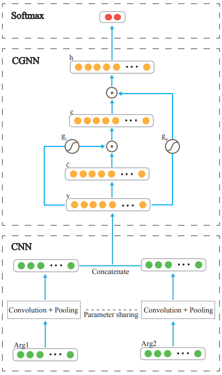

# DRR-benchmark
[TOC]

> Benchmarking discourse relation classification (DRR). This is a benchmarking test ground for discourse relation classification task, which is based on PDTB dataset.

### Dataset

As for discourse-level analysis, two datasets are mainly used: 

- PDTB: Penn Discourse Tree Bank;
- RST-DT: Rhetorical Structure Theory Discourse Tree Bank.

#### PDTB Split

- Train: 2-20 sections.
- Dev: 0-1 sections.
- Test: 21-22 sections.

### Recent papers

#### a. Discourse relation classification/recognition

##### 2017

- [Adversarial Connective-exploiting Networks for Implicit Discourse Relation Classification](http://aclweb.org/anthology/P/P17/P17-1093.pdf), ACL 2017. Lianhui Qin et al. `model`

- (**RNNAtt17**) [A Recurrent Neural Model with Attention for the Recognition of Chinese Implicit Discourse Relations](http://aclweb.org/anthology/P/P17/P17-2040.pdf), ACL 2017. `model`

  

- [Improving Implicit Relation Recognition with Discourse-specific Word Embeddings](http://aclweb.org/anthology/P/P17/P17-2042.pdf), ACL 2017. 

- [A Systematic Study of Neural Discourse Models for Implicit Discourse Relation](http://aclweb.org/anthology/E/E17/E17-1027.pdf), EACL 2017. 

- [Do We Need Cross Validation for Discourse Relation Classification](http://aclweb.org/anthology/E/E17/), EACL 2017. 

- [Discourse Relations and Conjoined VPs: Automated Sense Recognition](http://aclweb.org/anthology/E/E17/E17-4004.pdf), EACL 2017. 

- (**MTA17**) [Multi-task Attention-based Neural Networks for Implicit Discourse Relationship Representation and Identification](http://aclweb.org/anthology/D/D17/D17-1134.pdf), EMNLP 2017. Baidu Inc. `model`

  

##### 2016

- (**GRN16**) [Implicit Discourse Relation Detection via a Deep Architecture with Gated Relevance Network](http://aclweb.org/anthology/P/P16/P16-1163.pdf), ACL 2016. Fudan Univ. `model`

  

- [Modelling the Interpretation of Discourse Connectives by Bayesian Pragmatics](http://aclweb.org/anthology/P/P16/P16-2086.pdf), ACL 2016. 

- (**LVRNN16**) [A Latent Variable Recurrent Neural Network for Discourse-Driven Language Models](http://aclweb.org/anthology/N/N16/N16-1037.pdf), NAACL 2016. `model`

  

- [The Instantiation Discourse Relation: A Corpus Analysis of Its Properties and Improved Detection](http://aclweb.org/anthology/N/N16/N16-1141.pdf), NAACL 2016.

- [Learning Connective-based Word Representations for Implicit Discourse Relation Identification](http://aclweb.org/anthology/D/D16/D16-1020.pdf), EMNLP 2016. `model`

- (**VarDRR16**) [Variational Neural Discourse Relation Recognizer](http://aclweb.org/anthology/D/D16/D16-1037.pdf), EMNLP 2016. `model`

  

- (**RR16**) [Recognizing Implicit Discourse Relations via Repeated Reading: Neural Networks with Multi-Level Attention](http://aclweb.org/anthology/D/D16/D16-1130.pdf), EMNLP 2016. `model`

  

- (**SGN16**) [A Stacking Gated Neural Architecture for Implicit Discourse Relation Classification](http://aclweb.org/anthology/D/D16/D16-1246.pdf), EMNLP 2016. `model`

  

- [Bilingually-constrained Synthetic Data for Implicit Discourse Relation Recognition](http://aclweb.org/anthology/D/D16/D16-1253.pdf), EMNLP 2016. 

- (**CCE16**) [Implicit Discourse Relation Recognition with Context-aware Character-enhanced Embeddings](http://aclweb.org/anthology/C/C16/C16-1180.pdf), COLING 2016. `model`

  

#### b. Discourse relation related tasks/problem formulations

- [Neural Net Models of Open-domain Discourse Coherence](http://aclweb.org/anthology/D/D17/D17-1019.pdf), EMNLP 2017. Jiwei Li. 

### 